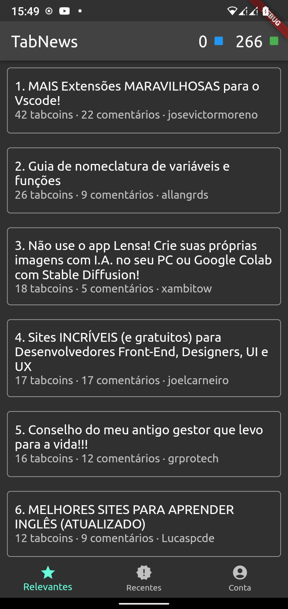

# TabNews App

Um app do tabnews para android e IOS feito em flutter, simples e rápido.



## Como rodar
1. instale as dependencias do projeto com o comando:
```bash
flutter pub get
```
2. Rode o build_runner para gerar os arquivos de (de)serialização de json
```bash
flutter pub run build_runner build
```
3. Rode o app com o comando:
```bash
flutter run
```